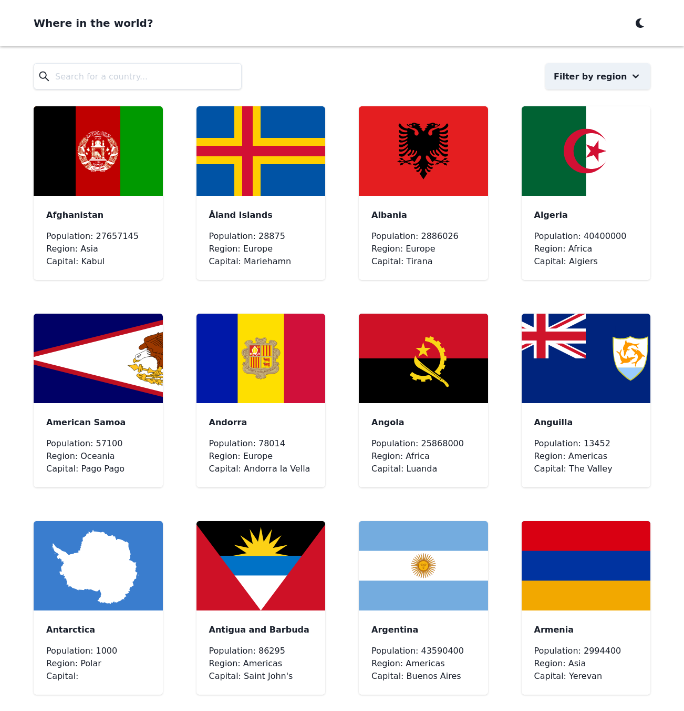
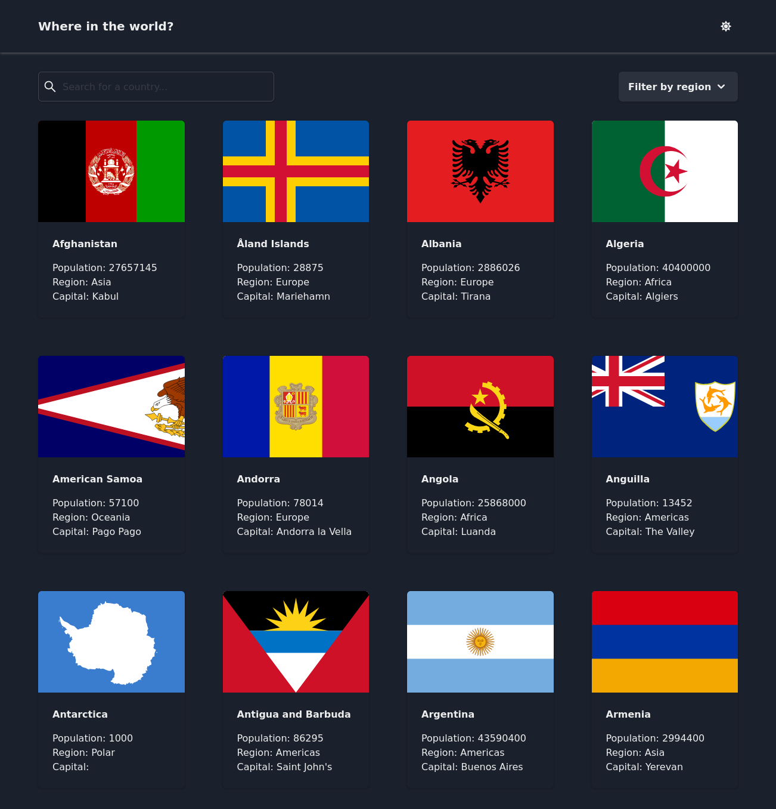
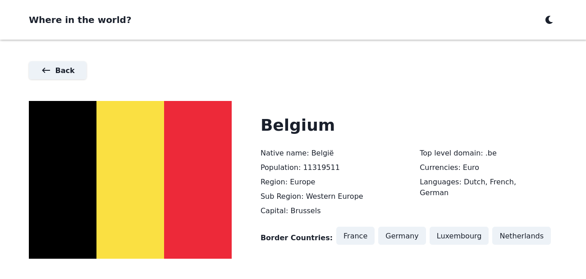
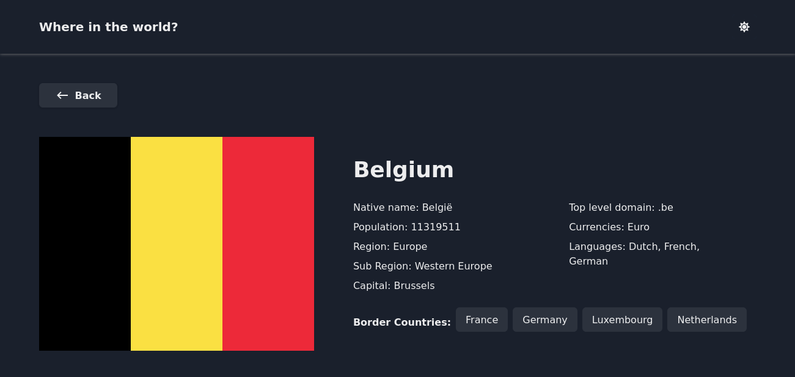
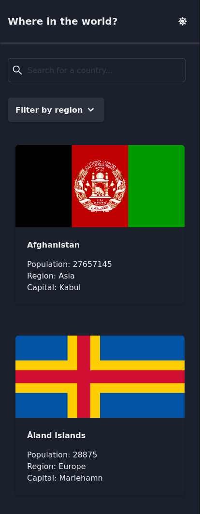
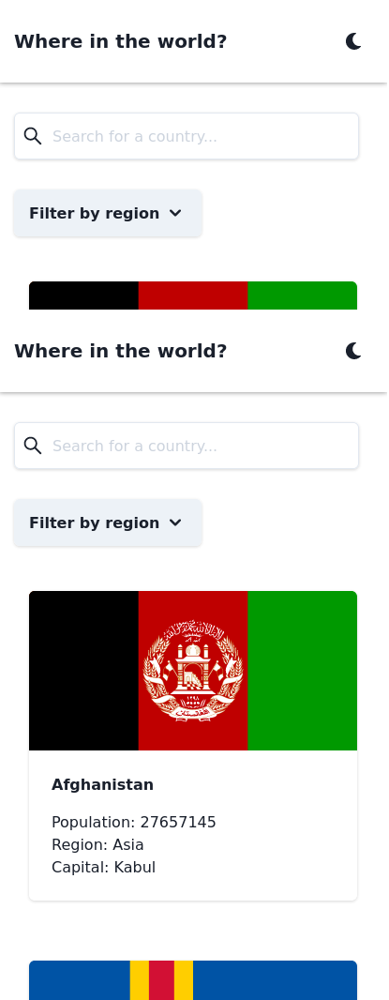
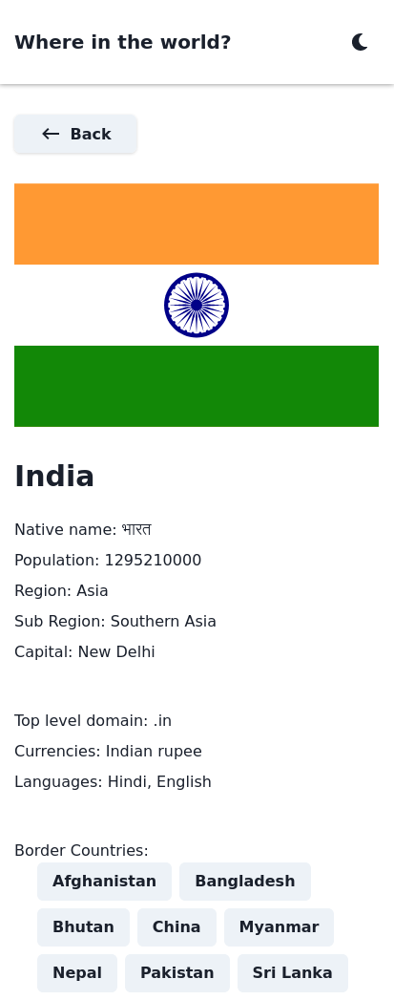
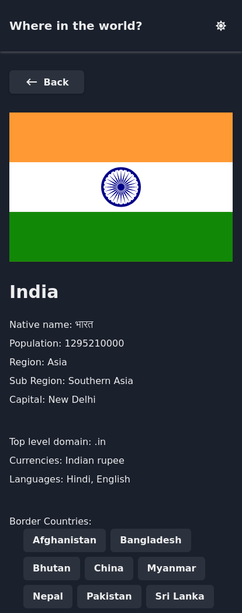

# Country Finder App

Search for any country and get it's information 🔎

## Table of contents

- [Stories](#stories)
- [Screenshot](#screenshot)
- [Links](#links)
- [Built with](#built-with)
- [Author](#author)

### Stories

Users should be able to:

- See all countries from the API on the homepage
- Search for a country using an `input` field
- Filter countries by region
- Click on a country to see more detailed information on a separate page
- Click through to the border countries on the detail page
- Toggle the color scheme between light and dark mode

### Screenshot

- 
- 
- 
- 
- 
- 
- 
- 

### Links

- Live Site URL: [Search Countries](https://search-countries-react.netlify.app/)
- Solution URL: [Source Code](https://github.com/sohhamm/search-countries-react)

### Built with

- [React](https://reactjs.org/) - JS library
- [Typescript](https://www.typescriptlang.org/)
- [Vite](https://vitejs.dev/) - Blazing fast build tool
- [SWR](https://swr.vercel.app/) - Data fetching & server state
- [Zustand](https://zustand.surge.sh/) - React state management
- [Chakra UI](https://chakra-ui.com/) - For styling
- [Search countries API](https://restcountries.eu/)
- [Netlify](https://www.netlify.com/) - Deployment

## Author

- Instagram - [@codebandit](https://www.instagram.com/codebandit/)
- LinkedIN - [Soham Sarkar](https://www.linkedin.com/in/sohhamm/)
- Twitter - [@sohhamm\_](https://www.twitter.com/sohhamm_)
- Personal Site - [soham sarkar](https://sohamsarkar.com)
